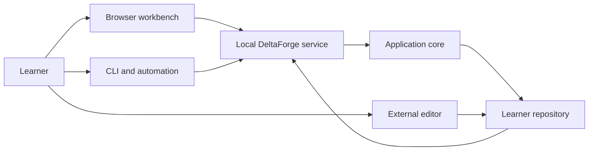

# Architecture decision: local-web-first workbench

Status: **Accepted -- frozen for Phase 1**
Decision date: 2026-07-15

## Context

The current product is CLI-authoritative. Interactive commands generate static HTML,
start or notify a per-project viewer, and direct a browser tab to the latest page. This
proved that a persistent visual surface improves learning and diagnostics, but it
creates two control planes:

- the terminal performs actions;
- the browser explains results;
- generated files bridge the two;
- the learner can encounter service lifecycle and refresh behavior.

This is appropriate as a transition architecture but not as the final product model.

## Decision

DeltaForge will use a local-web-first architecture:



- The browser workbench is the primary learning and orchestration surface.
- Source editing remains external.
- The CLI and browser invoke the same typed application operations.
- The Rust application core is authoritative for state, validation, tests, benchmarks,
  progression, and safety.
- A single invisible user-level service can manage multiple registered projects.
- The product works offline and without an account.
- Frontend assets and bundled project content ship with the binary or installation.
- The frontend renders application state; it does not independently infer learning
  progression.

## Compatibility position

DeltaForge 1.0 is a clean product break.

- Existing project-state migration is not required.
- Legacy command names, flags, output wording, and JSON shapes may change or disappear.
- The generated learning and live test pages are not retained as a parallel product.
- The paper/ember visual identity is retired.
- Useful engine behavior, schemas, test coverage, pack content, and diagnostics should
  be reused where they serve the new architecture.
- Cheap compatibility may be retained intentionally, but no Phase 1 design may be made
  substantially more complex to preserve legacy behavior.

When an old project or unsupported state is detected, the product should fail clearly
rather than attempt an unreliable migration. A separate manual import strategy may be
designed later only if real demand justifies it.

## Component responsibilities

### Application core

Owns:

- project discovery and validation;
- project creation;
- canonical learner state;
- pack loading and content interpretation;
- test and benchmark execution;
- progression and completion proofs;
- hints and experiments;
- Git integration;
- persistence and safety rules;
- typed application results and events.

It does not print terminal UI, render web pages, open browsers, or know frontend routes.

### Local service

Owns:

- process lifecycle;
- versioned local API;
- project registry;
- job scheduling and cancellation;
- event streaming;
- filesystem observation;
- session and origin security;
- frontend asset serving;
- browser navigation/focus integration where supported.

It accepts only defined DeltaForge operations. It never accepts arbitrary command lines
from browser requests.

### Browser workbench

Owns:

- visual hierarchy and interaction;
- accessible presentation;
- invoking allowed application actions;
- rendering live job events;
- local navigation between library, mission, runs, lab, chronicle, and finale;
- client-side ephemeral UI state.

It does not become the source of truth for completion, job results, or project health.

### CLI

Owns:

- command parsing;
- terminal rendering;
- structured machine output;
- service discovery or direct-core fallback where intentionally supported;
- scripting, CI, agent, and pack-author workflows.

The CLI does not generate or navigate the normal browser experience command by command.

## Service lifecycle

Running bare `deltaforge`:

1. resolves whether the current directory is a project;
2. probes a compatible local service;
3. starts or replaces the service when needed;
4. requests the appropriate project or library route;
5. opens or focuses the browser;
6. returns the terminal prompt.

The service:

- supports multiple projects and tabs;
- remains alive while workbench sessions or jobs are active;
- exits after a defined idle period;
- records enough metadata for health probing and safe replacement;
- handles sleep, wake, crashes, and binary upgrades without normal user intervention.

Service management may have a diagnostic command, but it is not normal product
navigation.

## Local security boundary

The service can execute pack-defined learner build and run commands, so the browser
boundary is security-sensitive.

Required controls:

- loopback-only binding;
- unguessable session capability;
- strict origin and host validation;
- no permissive cross-origin access;
- no arbitrary command execution endpoint;
- operations restricted to registered, validated projects;
- reuse of existing pack path and process safety;
- explicit confirmation for destructive or externally transmitting actions;
- bounded request bodies and output;
- no serving arbitrary repository files;
- protection against drive-by requests from unrelated webpages.

## Canonical application operations

The first application boundary should expose operations similar to:

```text
list_projects
locate_project
create_project
get_project_summary
get_workbench_state
get_capability
start_test_run
rerun_test
cancel_job
reveal_hint
complete_stage_snapshot
begin_capability
record_prediction
start_benchmark
record_reflection
get_chronicle
export_artifact
open_project_in_editor
```

Names may change during Phase 1. The important constraint is that each operation returns
typed domain data and events rather than printing or rendering directly.

## Job and event model

Tests, builds, benchmarks, and final challenges are jobs with:

- stable job identifier;
- project identifier;
- job kind;
- start and completion timestamps;
- phase and progress;
- structured events;
- cancellation state;
- final typed result;
- explicit interrupted/crashed outcome.

Representative events include:

```text
BuildStarted
BuildOutput
BuildCompleted
TestStarted
TestPassed
TestFailed
BenchmarkSampleRecorded
RunCompleted
SourceChanged
ProjectStateChanged
JobInterrupted
```

A job started from the CLI and one started from the browser are indistinguishable to the
project state and workbench event stream.

## Persistence direction

Phase 1 may define new state without migrating legacy files. New persistence should:

- use explicit schema versions;
- use atomic writes;
- separate durable project facts from bounded raw output;
- retain structured run summaries and completion evidence;
- support safe future migrations from the new 1.0 baseline;
- keep the project usable through CLI fallback when the browser is unavailable.

## Current command disposition

This table is directional, not a compatibility promise.

| Current command | Future disposition |
|---|---|
| bare invocation | Universal entrance: start/focus workbench |
| `list` | Project catalog/library operation; CLI form optional |
| `init` | Workbench creation flow plus intentional CLI form |
| `overview` | Workbench project overview; legacy command may disappear |
| `instructions` | Workbench current-capability route; legacy command may disappear |
| `test` | Core operation available from workbench and CLI |
| `next` | Replaced by automatic unlock and explicit Begin; command may disappear |
| `status` | Workbench summary plus useful CLI form |
| `hint` | Contextual workbench action; CLI form optional |
| `bench` | Performance-lab operation plus useful CLI form |
| `design` | Prediction/reflection experience; CLI form optional |
| `commit` | Stage-snapshot operation; CLI form optional |
| `report` | Export operation plus CLI form |
| `portfolio` | Replaced by evidence-backed engineering-story export |
| `explain-failure` | Folded into structured failure diagnosis |
| `doctor` | Preflight/recovery operation plus CLI diagnostic form |
| `serve` | Removed from normal surface; internal diagnostic only if needed |
| `sync-pack` | Project/pack maintenance action, likely CLI-first |
| `config` | Workbench settings plus CLI form where useful |
| `pack *` | Remains primarily CLI/agent authoring surface |
| `validate-pack` | Remains CLI/CI authoring surface |
| pack MCP server | Remains agent authoring integration |

## Consequences

### Benefits

- One coherent learner-facing control plane.
- Persistent context and resumption.
- Rich live testing and performance interactions.
- CLI and browser consistency through shared operations.
- Local ownership and offline use are preserved.
- The architecture can later be packaged in a native shell without changing the core
  product model.

### Costs

- Command logic must be separated from rendering and browser side effects.
- The local service becomes a significant security and reliability boundary.
- A real frontend application and durable event model must be maintained.
- Cross-platform service and browser behavior require extensive testing.
- Existing projects and current browser pages are deliberately left behind.

These costs are accepted because the current hybrid cannot provide the intended product
experience by incremental page-generation refinements alone.
